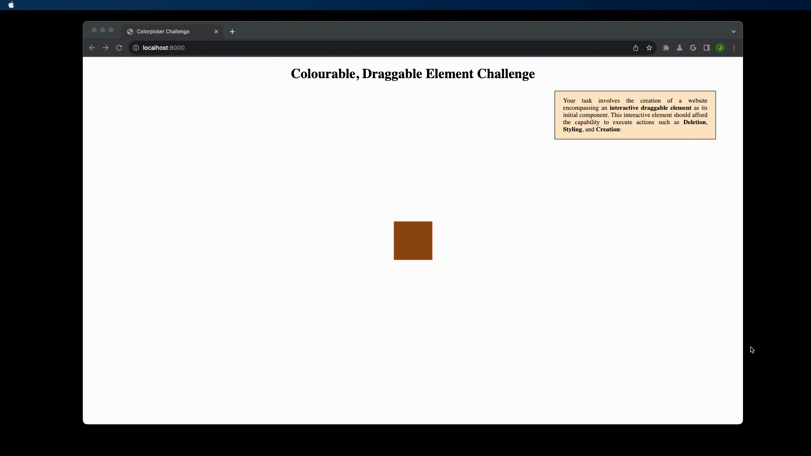

### Challenge - 001

The aim of this challenge is dealing with the followings:

- Inspect Events (MouseEvent)
- Add and remove eventListeners
- How to position an element `position: absolute`
- Apply/remove classes using js
- Hydrate an element on creation with js
- How to Work with Localstorage

### Task

This task is divided into four steps:

1. Create an Element that is draggable
2. Element will have three actions: Create, Style, Delete
3. Implement these Action:
   - Create instantiates an Element
   - Style pops up a colorpicker input which changes the element color
   - Delete the very element
4. The instantiated elment should have the draggability and actions on

### Screenshot

The end result should look roughly like the following GIF:

